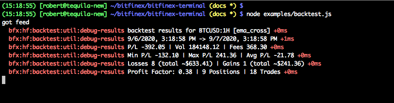

# Backtest your Trading Strategies with Bitfinex Terminal & Honey Framework

The Honey Framework provides easy ways to create and backtest trading strategies. Today we are taking a look at how you can backtest your trading strategies with Bitfinex Terminal data and Node.js. Bitfinex Terminal was released with the needs of algo traders in mind - a fast, reliable way to sync and share historical data. We will take a trading strategy, EMA Crossover, and backtest it on historical candle data.

We will run our backtest on 5-minute candles from BTCUSD trading data. That data is, like in a blockchain, stored in a Merkle Tree and can be cryptographically verified. The data is shared over a peer-to-peer (P2P) network and can be live-streamed. That means the backtest can start to run while we are fetching the data and resume the downloads after a connection reset is done for us. All these features make Terminal a compelling choice for sharing trading data and trading signals.

Bitfinex Terminal supports Dazaar Cards, which is an easy way to access the data streams. Every data stream has a unique ID, which is verified cryptographically, similar to a Bitcoin address. The Dazaar card contains a description of the content and the stream ID. Imagine it like a torrent file, but for encrypted, real-time data streams.


## Let's try it

You can clone this repo, run `npm install`, then run `node examples/backtest.js` to get the same result.

```sh
git clone https://github.com/bitfinexcom/bitfinex-terminal.git
cd bitfinex-terminal
npm install
node examples/backtest.js
```


## Try it Step by step

To start from fresh, we install the required dependencies:

```
npm install dazaar hyperbee bitfinex-terminal-key-encoding bfx-hf-util bfx-hf-backtest \
  bfx-hf-strategy bitfinex-terminal-terms-of-use

```

We also have to create a file; let's say `backtest.js`. We can now start to write our code.

To see the results of our backtest on the console we have to enable debug output:

```js
process.env.DEBUG = process.env.DEBUG || 'bfx:*'
```

The EMA-Cross-strategy we run today is one of the example strategies included in the Honey Framework. We load that strategy with our other dependencies. One dependency of it are the Terms of Use for Bitfinex Terminal - we will have to load them into Dazaar after reading and acknowledging them:


```js
const dazaar = require('dazaar')
const swarm = require('dazaar/swarm')
const Hyperbee = require('hyperbee')
const keyEncoding = require('bitfinex-terminal-key-encoding')

const HFBT = require('bfx-hf-backtest')
const { SYMBOLS, TIME_FRAMES } = require('bfx-hf-util')
const EMAStrategy = require('bfx-hf-strategy/examples/ema_cross')

const terms = require('bitfinex-terminal-terms-of-use')
```

We also define a small helper function to give us the time from exactly 24 hours in the past:

```js
const get24HoursAgo = (date) => {
  const res = date.getTime() - (1 * 86400 * 1000)

  return new Date(res)
}
```

For backtesting, we have to define the market we test and pass it to the EMA Strategy:

```js
const market = {
  symbol: SYMBOLS.BTC_USD,
  tf: TIME_FRAMES.FIVE_MINUTES
}

const strat = EMAStrategy(market)
```

Then we can initialise Dazaar:

```js
const dmarket = dazaar('dbs/terminal-backtest')
```

With the above command, Dazaar will create a local database in `dbs/terminal-backtest`. All of our data will be stored in this folder, so if you want to start over, you can simply delete it.

As the next step we download the Dazaar Card for BTCUSD from [https://raw.githubusercontent.com/bitfinexcom/bitfinex-terminal/master/cards/free-candles/bitfinex.terminal.btcusd.candles.json](https://raw.githubusercontent.com/bitfinexcom/bitfinex-terminal/master/cards/free-candles/bitfinex.terminal.btcusd.candles.json) and load it:

```
wget https://raw.githubusercontent.com/bitfinexcom/bitfinex-terminal/master/cards/free-candles/bitfinex.terminal.btcusd.candles.json
```

```js
const card = require('./bitfinex.terminal.btcusd.candles.json')
```

Dazaar also supports paid feeds, e.g. for selling trading signals of a successful strategy, but the Bitfinex Terminal data is free. Our card is loaded into Dazaar. We enable sparse mode, with sparse mode set, it will just download data requested from us. We also load the terms of service we required above, after we read and acknowledged them:

```js
const buyer = dmarket.buy(card, { sparse: true, terms })
```

If we wanted to download a full copy of all candles in the background, we would set `sparse` to `false`.

Once the data is ready, Dazaar will emit a `feed` event. After that is emitted, we can set up Hyperbee on top of the Dazaar feed. Hyperbee provides us with a B-Tree structure for easy querying of the data. For Terminal, we use a special key encoding module, which makes querying the data easier. We already loaded the key encoding module with `const keyEncoding = require('bitfinex-terminal-key-encoding')`. Once the Hyperbee database is set up, we can call `runTest` and work with the database:

```js
buyer.on('feed', function () {
  console.log('got feed')

  const db = new Hyperbee(buyer.feed, {
    keyEncoding,
    valueEncoding: 'json'
  })

  runTest(db)
})
```

The last part of our backtest is the actual testing. For that, we have to define the function `runTest`:

```js
async function runTest (db) {

}
```

Inside the function `runTest` we have to define the timeframe we want to use for our test. For the beginning of the timeframe, we use the helper function we created at the beginning of our tutorial. The value for `to` points to the current time:

```js
 const from = get24HoursAgo(new Date())
 const to = new Date()
```

Together with our strategy and the market, we are passing the timeframe definitions to `HFBT.execStream`. It returns a function called `exec` and a function called `onEnd`:

```js
  const { exec, onEnd } = await HFBT.execStream(strat, market, {
    from,
    to
  })
```

The function `exec` will be applied to each element of the stream, but first we have to initiate the stream. We will run our test on `5m` candles. To get all data within that 24 hour timeframe we use our variables `from` and `to` in the respective fields `lte` (less than equal) and `gte` (greater than equal):

```js
  const stream = db.createReadStream({
    gte: { candle: TIME_FRAMES.FIVE_MINUTES, timestamp: from },
    lte: { candle: TIME_FRAMES.FIVE_MINUTES, timestamp: to }
  })
```

With the help of an Async Iterator we call exec on every entry and store the result in `btState`:

```js
  let btState
  for await (const data of stream) {
    const { key, value } = data
    btState = await exec(key, value)
  }
```

Then, once the iterator gives us no results any more, we call the function `onEnd`, which will print our results to the console:

```js
  await onEnd(btState)
```

Here is the whole function `runTest`:

```js
async function runTest (db) {
  const from = get24HoursAgo(new Date())
  const to = new Date()

  const { exec, onEnd } = await HFBT.execStream(strat, market, {
    from,
    to
  })

  const stream = db.createReadStream({
    gte: { candle: TIME_FRAMES.FIVE_MINUTES, timestamp: from },
    lte: { candle: TIME_FRAMES.FIVE_MINUTES, timestamp: to }
  })

  let btState
  for await (const data of stream) {
    const { key, value } = data
    btState = await exec(key, value)
  }

  await onEnd(btState)
}
```


After finishing the function `runTest`, we are almost done. To start everything, we have to go online:

```js
swarm(buyer)
```

[Here is the whole code in one file for our backtest](../examples/backtest.js).

Now, when we run our file, we get the result printed to the console:



As you can see, we would have made a loss with this strategy during the timeframe 9/6/2020, 3:18:58 PM to 9/7/2020, 3:18:58 PM, when this article was written.

## Conclusion

In this article, we've taken a look at how backtesting a Honey Framework trading strategy works with Bitfinex Terminal. We were able to create a backtest in under 70 lines of code with an easy and reliable way to sync large amounts of data. Everything was running on top of Dazaar, which can be used to sell trading signals too. One of our next articles will cover exactly that topic, so stay tuned!
